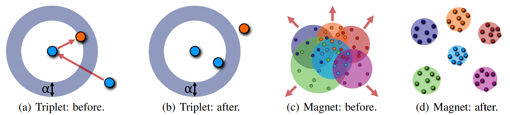
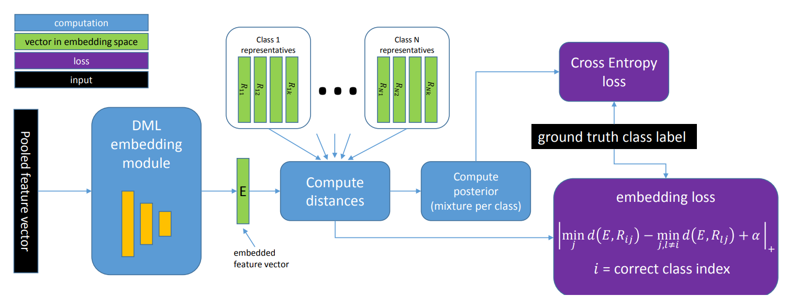

# Magnet Loss and RepMet in PyTorch

This takes a lot from the Tensorflow Magnet Loss code: [pumpikano/tf-magnet-loss](https://github.com/pumpikano/tf-magnet-loss)

### Magnet Loss

"[Metric Learning with Adaptive Density Discrimination](http://arxiv.org/pdf/1511.05939v2.pdf)" introduced
a new optimization objective for distance metric learning called Magnet Loss that, unlike related losses,
operates on entire neighborhoods in the representation space and adaptively defines the similarity that is
being optimized to account for the changing representations of the training data.

### RepMet

"[RepMet: Representative-based Metric Learning for Classification and One-shot Object Detection](https://arxiv.org/pdf/1806.04728.pdf)"
extends upon magnet loss by storing the centroid as representations that are learnable, rather than just
 statically calculated every now and again with k-means.

## Implementation

**NOTE: Currently only classification, RepMet's detection functionality coming soon :)**

Tested with **python 3.6 + pytorch 0.4 + cuda 9.1**

See `train.py` for training the model, please ensure your `path` is set in `configs.py`.

### RepMet.v2
There are two versions of the RepMet loss implemented in this code, as the original authors suggested this modification from the original paper.

**Version 1:**
As in the original paper it uses the closest (R*) representative in the numerator and disregards same class representatives in the denominator:

where:

**Version 2:**
Sums the distance of all representatives of the same class in the numerator, and doesn't disregard any in the denominator.

### MyLoss
Testing my own loss as the RepMet's don't make sense to me yet... (never reach 0 as denom is always greater than
 numerator). My loss is defined as:
 

Takes max distance of embeddings with their same-class clusters/reps/modes plus the alpha margin, and subtracts this from
every distance for all embeddings. We only sum the J clusters/reps that correspond to the classes seen in the batch
(which is different from what repmet seems to do [have to check with authors], but same as magnet [as the means are taken]).

## Datasets
Currently works on MNIST, working on getting the implementation to work with [Oxford Flowers 102](http://www.robots.ox.ac.uk/~vgg/data/flowers/102/) and [Stanford Dogs](http://vision.stanford.edu/aditya86/ImageNetDogs/) at the moment.

## Evaluation
During training a number of accuracies are calculated:

**1. Batch Accuracy:**
In the batch what % of the batch samples are correctly assigned to their cluster (for magnet loss this is how close to their in-batch mean).

**2. Simple Accuracy:** 
Assign a sample `x` to its closest training cluster.

 
**3. Magnet Accuracy:** 
Use eq. 6 from [Magnet Loss Paper](http://arxiv.org/pdf/1511.05939v2.pdf). Take `min(L, n_clusters)` closest clusters to a sample `x`,
then take the sum of the distances of the same classes for each class and take the min (or max after exp).

where  is the avg of all  in training. Is equivalent to Simple Accuracy when `n_clusters < L` and `k=1`.

**4. RepMet Accuracy:** 
Use eq. 6 from [RepMet Loss Paper](https://arxiv.org/pdf/1806.04728.pdf). Equivalent to Magnet Accuracy however takes all clusters (`n_clusters`) into consideration not just top `L`.
Also doesn't normalise into probability distribution before the arg max.

where  is set to `0.5` as in training. Is equivalent to Simple Accuracy when `k=1`.

**5. Unsupervised Accuracy:** 
Run K-Means on set (ie. don't use trained clusters) and then greedily assign classes to clusters based on the class of samples that fall in that cluster.  

*Test Error can be considered `1-a` (1 minus these accuracies)*

## Results (Coming Soon)
After 1000 iterations with pretrained ResNet18 with last fc layer replaced with a 1024 embedding layer, M=12, D=4, K=3

[Oxford Flowers 102](http://www.robots.ox.ac.uk/~vgg/data/flowers/102/)

|              | Simple Error   | Magnet Error   | RepMet Error   |
| ------------ | -------------: | -------------: | -------------: |
| **Loss**     |**Train (Test)**|**Train (Test)**|**Train (Test)**|
| *Magnet Loss*| 00.00 (00.00)  | 00.00 (00.00)  | 00.00 (00.00)  |
| *RepMet.v1*  | 00.00 (00.00)  | 00.00 (00.00)  | 00.00 (00.00)  |
| *RepMet.v2*  | 00.00 (00.00)  | 00.00 (00.00)  | 00.00 (00.00)  |
| *RepMet.v3*  | 00.00 (00.00)  | 00.00 (00.00)  | 00.00 (00.00)  |
| *My Loss*    | 00.00 (00.00)  | 00.00 (00.00)  | 00.00 (00.00)  |